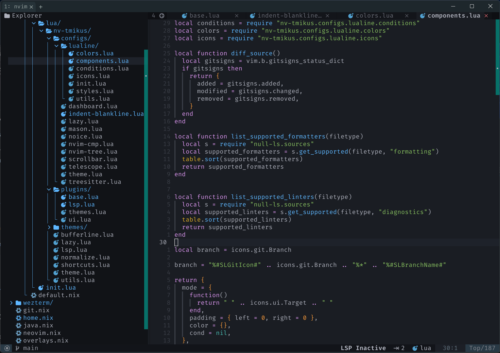
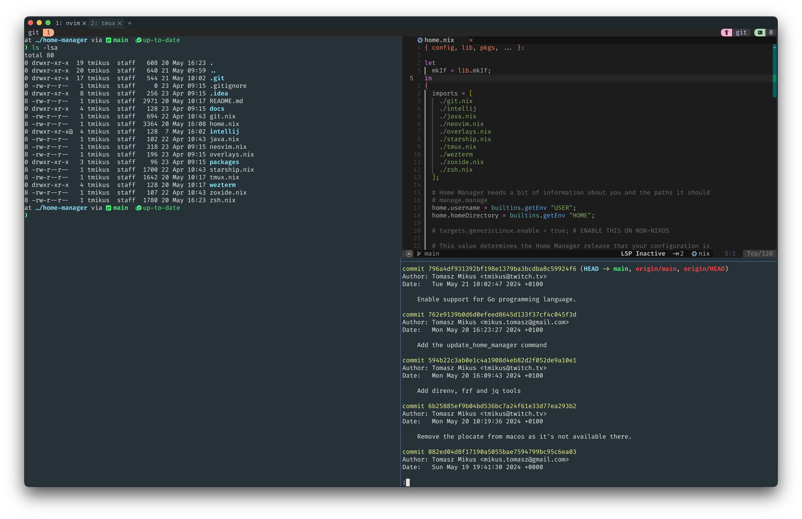
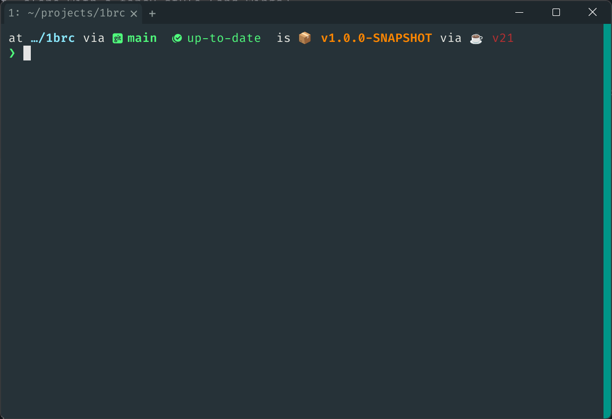

## What is this

This repository contains configuration that is used to set-up a ready-to-use development environment according to my needs.

It can be used on a local desktop, laptop or on a cloud desktop.

The configuration is made portable with the use of the [Nix Home Manager](https://nix-community.github.io/home-manager/index.xhtm)

Some of the tools installed by this configuration include:


### [NeoVim](https://neovim.io/)




### [Bat](https://github.com/sharkdp/bat)

A `cat` clone with a fancy style (and wings)


### [tmux](https://github.com/tmux/tmux/wiki)




### [zoxide](https://github.com/ajeetdsouza/zoxide)

zoxide is a smarter cd command, inspired by z and autojump.

It remembers which directories you use most frequently, so you can "jump" to them in just a few keystrokes.
zoxide works on all major shells.


### zsh terminal + Oh My ZSH + starship




### Programming languages

* Go
* NodeJS 20
* Python 3.11 with `pip`, `setuptools` and `wheel`
* Rust (rustc + rustfmt + cargo)
* zig

### Others

* clang (not on MacOS)
* gnumake (not on MacOS)
* delta (used for a fancy git diff)
* thefuck
* unzip
* wget

## Pre-requisites

In order to use this configuration you'll need to first install the following tools:

**Nix Package Manager**

Before you're able to install the Nix Home Manager you need to install the Nix Package manager.

The instructions depend on the OS you're on. For NixOS you don't need to do anything as it comes with the package manager, but on other OS here are the instructions:

* [Linux](https://nixos.org/download/#nix-install-linux)
* [MacOS](https://nixos.org/download/#nix-install-macos)
* [Windows - WSL2](https://nixos.org/download/#nix-install-windows)
* [More](https://nixos.org/download/#nix-more)

**Additional step on AL2**

On AL2 you'll need to also run the following commands after installing Nix Package Manager in order to create the right user group and add you to it:

```bash
sudo groupadd -r nixbld
```

Then run to add all users to the `nixbld` group:

```bash
for n in $(seq 1 10); do sudo useradd -c "Nix build user $n" \
    -d /var/empty -g nixbld -G nixbld -M -N -r -s "$(which nologin)" \
    nixbld$n; done
```


**Nix Home Manager**

To install it, simply follow the steps from [Standalone Installation](https://nix-community.github.io/home-manager/index.xhtml#ch-installation) page, copied here for simplicity:

```bash
nix-channel --add https://github.com/nix-community/home-manager/archive/master.tar.gz home-managers
nix-channel --add https://nixos.org/channels/nixpkgs-unstable
nix-channel --update

nix-shell '<home-manager>' -A install
```

## Installation

Once you have the Home Manager installed, simply clone this repository in `~/.config/home-manager` and run `home-manager switch`

```bash
cd ~/.config/
rm -rf home-manager # Remove prior Home Manager configuration
nix-shell -p git # Open a new shell with git enabled
git clone https://github.com/tmikus/nix-config.git home-manager
exit # exit the git-enabled shell

home-manager switch
```

## Known issues

### Initial home-manager switch fails

From experience the main reason why the initial `home-manager switch` fails is because you already have some files that would clash with new configuration.
For example, you might already have a `.zshrc`, `.zprofile` or `.zshenv` files in your home folder.

To fix this please make a backup of these files by renaming them to something like `.zshrc.backup-before-nix` and try again.

### Nix not found after MacOS update

Sometimes upating MacOS can result in Nix being removed from the `/etc/zshrc` file. To recover it simply add the following at the back of the `/etc/zshrc` file:
```
# Nix
if [ -e '/nix/var/nix/profiles/default/etc/profile.d/nix-daemon.sh' ]; then
  . '/nix/var/nix/profiles/default/etc/profile.d/nix-daemon.sh'
fi
# End Nixs
```
